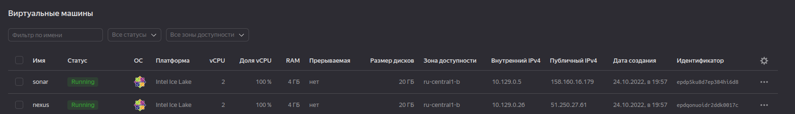
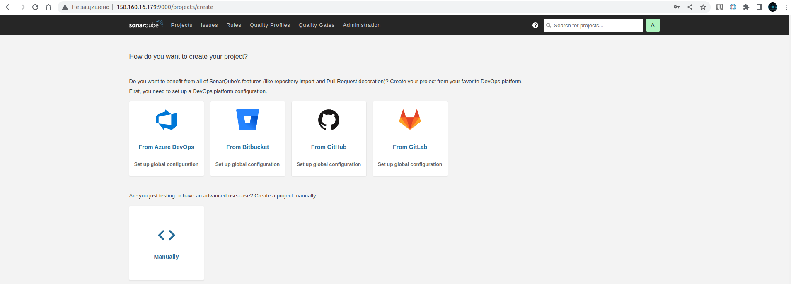
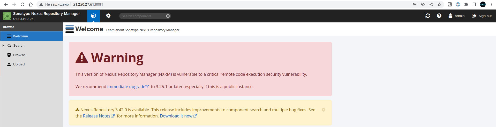
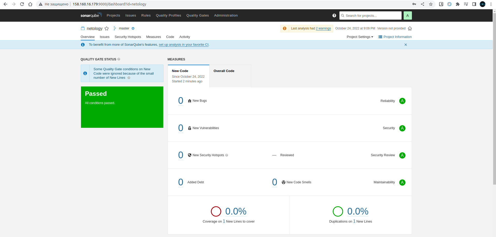
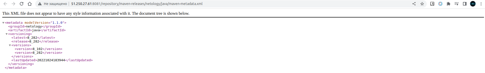

# Домашнее задание к занятию "09.03 CI\CD"

## Подготовка к выполнению

1. Создаём 2 VM в yandex cloud со следующими параметрами: 2CPU 4RAM Centos7(остальное по минимальным требованиям)

---
<p align="left">
  
</p>
---

2. Прописываем в [inventory](./infrastructure/inventory/cicd/hosts.yml) [playbook'a](./infrastructure/site.yml) созданные хосты

---
```yaml
---
all:
  hosts:
    sonar-01:
      ansible_host: 158.160.16.179
    nexus-01:
      ansible_host: 51.250.27.61
  children:
    sonarqube:
      hosts:
        sonar-01:
    nexus:
      hosts:
        nexus-01:
    postgres:
      hosts:
        sonar-01:
  vars:
    ansible_connection_type: paramiko
    ansible_user: alex
```
---

3. Добавляем в [files](./infrastructure/files/) файл со своим публичным ключом (id_rsa.pub). Если ключ называется иначе - найдите таску в плейбуке, которая использует id_rsa.pub имя и исправьте на своё

---
```bash
alex@alexPC:~$ ls -l ~/Github/DevOps/CI/09-ci-03-cicd/infrastructure/files/ | grep  .pub
-rw-r--r-- 1 alex alex  565 окт 24 20:00 id_rsa.pub
alex@alexPC:~$ 
```
---

4. Запускаем playbook, ожидаем успешного завершения

---
```yaml
PLAY RECAP ***********************************************************************************************************************************************************************
nexus-01                   : ok=17   changed=15   unreachable=0    failed=0    skipped=2    rescued=0    ignored=0   
sonar-01                   : ok=35   changed=24   unreachable=0    failed=0    skipped=0    rescued=0    ignored=0 
```
---

5. Проверяем готовность Sonarqube через [браузер](http://localhost:9000)
6. Заходим под admin\admin, меняем пароль на свой
   
---

<p align="left">
  
</p>

---

7.  Проверяем готовность Nexus через [бразуер](http://localhost:8081)
8. Подключаемся под admin\admin123, меняем пароль, сохраняем анонимный доступ

---

<p align="left">
  
</p>

---


## Знакомоство с SonarQube

### Основная часть

1. Создаём новый проект, название произвольное
2. Скачиваем пакет sonar-scanner, который нам предлагает скачать сам sonarqube
3. Делаем так, чтобы binary был доступен через вызов в shell (или меняем переменную PATH или любой другой удобный вам способ)
4. Проверяем `sonar-scanner --version`

---
```bash
alex@alexPC:~/Github/DevOps/CI/09-ci-03-cicd/example$ sonar-scanner --version
INFO: Scanner configuration file: /home/alex/Загрузки/sonar-scanner-4.7.0.2747-linux/conf/sonar-scanner.properties
INFO: Project root configuration file: NONE
INFO: SonarScanner 4.7.0.2747
INFO: Java 11.0.14.1 Eclipse Adoptium (64-bit)
INFO: Linux 5.15.0-48-generic amd64
```
---

5. Запускаем анализатор против кода из директории [example](./example) с дополнительным ключом `-Dsonar.coverage.exclusions=fail.py`

---
```bash
INFO: ANALYSIS SUCCESSFUL, you can browse http://158.160.16.179:9000/dashboard?id=netology
INFO: Note that you will be able to access the updated dashboard once the server has processed the submitted analysis report
INFO: More about the report processing at http://158.160.16.179:9000/api/ce/task?id=AYQLNVY38tTgnanVk5pu
INFO: Analysis total time: 6.633 s
INFO: ------------------------------------------------------------------------
INFO: EXECUTION SUCCESS
INFO: ------------------------------------------------------------------------
INFO: Total time: 7.225s
INFO: Final Memory: 17M/80M
INFO: ------------------------------------------------------------------------
```
---

6. Смотрим результат в интерфейсе
7. Исправляем ошибки, которые он выявил(включая warnings)
8. Запускаем анализатор повторно - проверяем, что QG пройдены успешно
9.  Делаем скриншот успешного прохождения анализа, прикладываем к решению ДЗ

---

<p align="left">
  
</p>

---

## Знакомство с Nexus

### Основная часть

1. В репозиторий `maven-releases` загружаем артефакт с GAV параметрами:
   1. groupId: netology
   2. artifactId: java
   3. version: 8_282
   4. classifier: distrib
   5. type: tar.gz
2. В него же загружаем такой же артефакт, но с version: 8_102
3. Проверяем, что все файлы загрузились успешно
4. В ответе присылаем файл `maven-metadata.xml` для этого артефекта

---

<p align="left">
  
</p>

---


### Знакомство с Maven

### Подготовка к выполнению

1. Скачиваем дистрибутив с [maven](https://maven.apache.org/download.cgi)
2. Разархивируем, делаем так, чтобы binary был доступен через вызов в shell (или меняем переменную PATH или любой другой удобный вам способ)
3. Удаляем из `apache-maven-<version>/conf/settings.xml` упоминание о правиле, отвергающем http соединение( раздел mirrors->id: my-repository-http-blocker)
4. Проверяем `mvn --version`

---
```bash
alex@alexPC:~/Github/DevOps/CI/09-ci-03-cicd$ mvn --version
Apache Maven 3.8.6 (84538c9988a25aec085021c365c560670ad80f63)
Maven home: /home/alex/Загрузки/apache-maven-3.8.6
Java version: 11.0.16, vendor: Ubuntu, runtime: /usr/lib/jvm/java-11-openjdk-amd64
Default locale: ru_RU, platform encoding: UTF-8
OS name: "linux", version: "5.15.0-48-generic", arch: "amd64", family: "unix"
alex@alexPC:~/Github/DevOps/CI/09-ci-03-cicd$ 
```
---

5. Забираем директорию [mvn](./mvn) с pom

### Основная часть

1. Меняем в `pom.xml` блок с зависимостями под наш артефакт из первого пункта задания для Nexus (java с версией 8_282)
2. Запускаем команду `mvn package` в директории с `pom.xml`, ожидаем успешного окончания
3. Проверяем директорию `~/.m2/repository/`, находим наш артефакт
4. В ответе присылаем исправленный файл `pom.xml`

