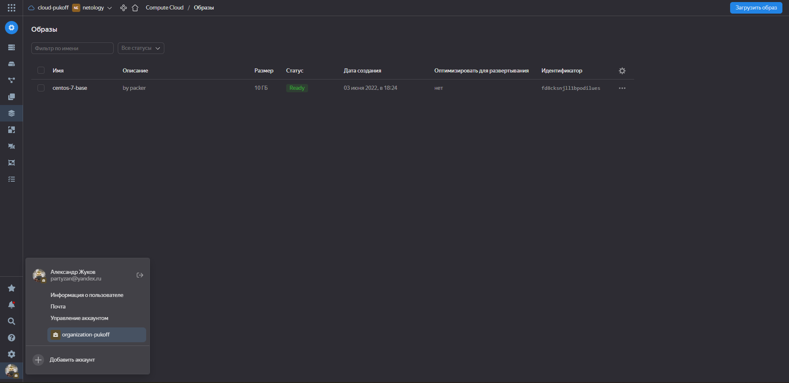
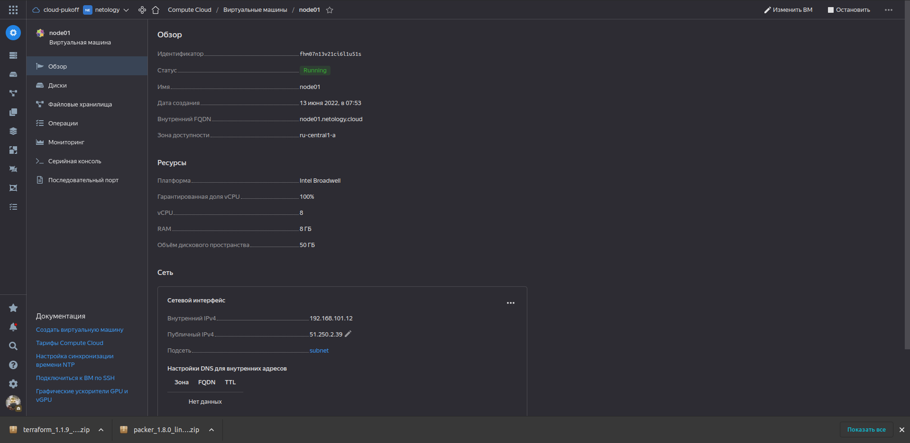
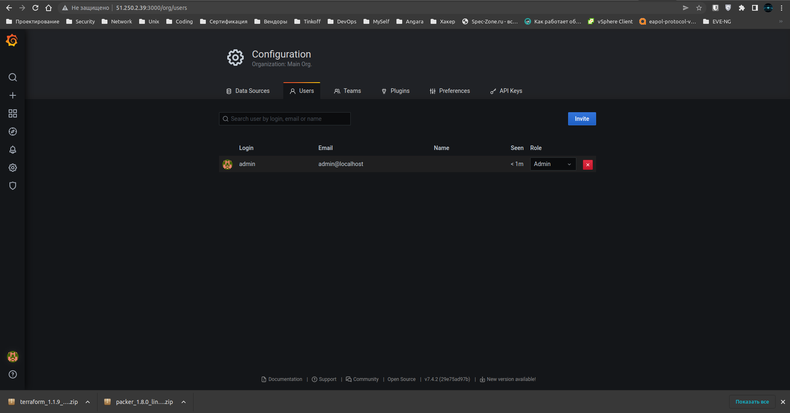

# Домашнее задание к занятию "5.4. Оркестрация группой Docker контейнеров на примере Docker Compose"

---

## Задача 1

Создать собственный образ операционной системы с помощью Packer.

Для получения зачета, вам необходимо предоставить:
- Скриншот страницы, как на слайде из презентации (слайд 32).

<p align="center">
  
</p>

## Задача 2

Создать вашу первую виртуальную машину в Яндекс.Облаке.

Для получения зачета, вам необходимо предоставить:
- Скриншот страницы свойств созданной ВМ, как на примере ниже:

<p align="center">
  
</p>

## Задача 3

Создать ваш первый готовый к боевой эксплуатации компонент мониторинга, состоящий из стека микросервисов.

Для получения зачета, вам необходимо предоставить:
- Скриншот работающего веб-интерфейса Grafana с текущими метриками, как на примере ниже

<p align="center">
  
</p>

```bash
alex@AlexPC:~$./terraform apply

Terraform used the selected providers to generate the following execution plan. Resource actions are indicated with the following symbols:
  + create

Terraform will perform the following actions:

  # yandex_compute_instance.node01 will be created
  + resource "yandex_compute_instance" "node01" {
      + allow_stopping_for_update = true
      + created_at                = (known after apply)
      + folder_id                 = (known after apply)
      + fqdn                      = (known after apply)
      + hostname                  = "node01.netology.cloud"
      + id                        = (known after apply)
      + metadata                  = {
          + "ssh-keys" = <<-EOT
                centos-7-base:ssh-rsa AAAAB3NzaC1yc2EAAAADAQABAAABgQDLvocwbmwxawPpeplRAocOl4xDBejqddLYc9+Lj5/FEhBGJsPTC/sxgRmkOPBTHQiKGswYGzvK00FT9yFh5YVpfRa+DSRAtY/DC/T2lrHYueTN2p8ElUBcfeTC0JUlXMcQi8GouTqAPOvfzdLKypeF+JI9Ixzr8BJVSKARx49joMNQklaQq0nrGuP/4dYDwKhLOd9MqXsWZVjUCj7dAtWwOFIFInRpNdk3h5cqREPc80tm6Hr8ULUa92v4mUGVIqyQMnKd8AziOjjmplboG8qYW5pkrRgSsKMMuV5NRuyCkMgutWX3tw6ZdakplOmLFBSR0wxFxJm/uT7r5otMnowVjo4ywtjE/JH18XPcqX1C3yXEBfNtHw3+RFj/w9AbGZLEjMd+nx/oNhqro4HBRa/RRChGpUWimRuHYGEMeHZqznLFrmFwe6im0gXF/K3uxtLdPDD4C3RMhHmrSsgibeTNnQ+FdCRIt3c3l3Jh7ZvmX8DusiEXuFxP98IpMeVcDas= alex@AlexPC
            EOT
        }
      + name                      = "node01"
      + network_acceleration_type = "standard"
      + platform_id               = "standard-v1"
      + service_account_id        = (known after apply)
      + status                    = (known after apply)
      + zone                      = "ru-central1-a"

      + boot_disk {
          + auto_delete = true
          + device_name = (known after apply)
          + disk_id     = (known after apply)
          + mode        = (known after apply)

          + initialize_params {
              + block_size  = (known after apply)
              + description = (known after apply)
              + image_id    = "fd8i594dpomjeqlotomk"
              + name        = "root-node01"
              + size        = 50
              + snapshot_id = (known after apply)
              + type        = "network-nvme"
            }
        }

      + network_interface {
          + index              = (known after apply)
          + ip_address         = (known after apply)
          + ipv4               = true
          + ipv6               = (known after apply)
          + ipv6_address       = (known after apply)
          + mac_address        = (known after apply)
          + nat                = true
          + nat_ip_address     = (known after apply)
          + nat_ip_version     = (known after apply)
          + security_group_ids = (known after apply)
          + subnet_id          = (known after apply)
        }

      + placement_policy {
          + host_affinity_rules = (known after apply)
          + placement_group_id  = (known after apply)
        }

      + resources {
          + core_fraction = 100
          + cores         = 8
          + memory        = 8
        }

      + scheduling_policy {
          + preemptible = (known after apply)
        }
    }

  # yandex_vpc_network.default will be created
  + resource "yandex_vpc_network" "default" {
      + created_at                = (known after apply)
      + default_security_group_id = (known after apply)
      + folder_id                 = (known after apply)
      + id                        = (known after apply)
      + labels                    = (known after apply)
      + name                      = "network"
      + subnet_ids                = (known after apply)
    }

  # yandex_vpc_subnet.default will be created
  + resource "yandex_vpc_subnet" "default" {
      + created_at     = (known after apply)
      + folder_id      = (known after apply)
      + id             = (known after apply)
      + labels         = (known after apply)
      + name           = "subnet"
      + network_id     = (known after apply)
      + v4_cidr_blocks = [
          + "192.168.101.0/24",
        ]
      + v6_cidr_blocks = (known after apply)
      + zone           = "ru-central1-a"
    }

Plan: 3 to add, 0 to change, 0 to destroy.

Changes to Outputs:
  + external_ip_address_node01_yandex_cloud = (known after apply)
  + internal_ip_address_node01_yandex_cloud = (known after apply)

Do you want to perform these actions?
  Terraform will perform the actions described above.
  Only 'yes' will be accepted to approve.

  Enter a value: yes

yandex_vpc_network.default: Creating...
yandex_vpc_network.default: Creation complete after 1s [id=enp05jbfjocejq1po5ko]
yandex_vpc_subnet.default: Creating...
yandex_vpc_subnet.default: Creation complete after 1s [id=e9b5ppumogalco8o924g]
yandex_compute_instance.node01: Creating...
yandex_compute_instance.node01: Still creating... [10s elapsed]
yandex_compute_instance.node01: Still creating... [20s elapsed]
yandex_compute_instance.node01: Creation complete after 27s [id=fhm07n13v21ci6l1u51s]

Apply complete! Resources: 3 added, 0 changed, 0 destroyed.

Outputs:

external_ip_address_node01_yandex_cloud = "51.250.2.39"
internal_ip_address_node01_yandex_cloud = "192.168.101.12"

alex@AlexPC:~$ ansible-playbook provision.yml 

PLAY [nodes] ****************************************************************************************************************************************************************************************************************

TASK [Gathering Facts] ******************************************************************************************************************************************************************************************************
ok: [node01.netology.cloud]

TASK [Create directory for ssh-keys] ****************************************************************************************************************************************************************************************
ok: [node01.netology.cloud]

TASK [Adding rsa-key in /root/.ssh/authorized_keys] *************************************************************************************************************************************************************************
ok: [node01.netology.cloud]

TASK [Checking DNS] *********************************************************************************************************************************************************************************************************
changed: [node01.netology.cloud]

TASK [Installing tools] *****************************************************************************************************************************************************************************************************
ok: [node01.netology.cloud] => (item=['git', 'curl'])

TASK [Add docker repository] ************************************************************************************************************************************************************************************************
changed: [node01.netology.cloud]

TASK [Installing docker package] ********************************************************************************************************************************************************************************************
ok: [node01.netology.cloud] => (item=['docker-ce', 'docker-ce-cli', 'containerd.io'])

TASK [Enable docker daemon] *************************************************************************************************************************************************************************************************
ok: [node01.netology.cloud]

TASK [Install docker-compose] ***********************************************************************************************************************************************************************************************
changed: [node01.netology.cloud]

TASK [Synchronization] ******************************************************************************************************************************************************************************************************
changed: [node01.netology.cloud]

TASK [Pull all images in compose] *******************************************************************************************************************************************************************************************
changed: [node01.netology.cloud]

TASK [Up all services in compose] *******************************************************************************************************************************************************************************************
changed: [node01.netology.cloud]

PLAY RECAP ******************************************************************************************************************************************************************************************************************
node01.netology.cloud      : ok=12   changed=6    unreachable=0    failed=0    skipped=0    rescued=0    ignored=0   

alex@AlexPC:~$ ^C
alex@AlexPC:~$ 
```


## Задача 4 (*)

Создать вторую ВМ и подключить её к мониторингу развёрнутому на первом сервере.

Для получения зачета, вам необходимо предоставить:
- Скриншот из Grafana, на котором будут отображаться метрики добавленного вами сервера.
