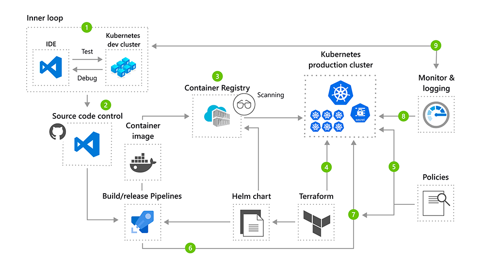

# Домашнее задание к занятию "11.4 Микросервисы: масштабирование"

Вы работаете в крупной компанию, которая строит систему на основе микросервисной архитектуры.
Вам как DevOps специалисту необходимо выдвинуть предложение по организации инфраструктуры, для разработки и эксплуатации.

## Задача 1: Кластеризация

Предложите решение для обеспечения развертывания, запуска и управления приложениями.
Решение может состоять из одного или нескольких программных продуктов и должно описывать способы и принципы их взаимодействия.

Решение должно соответствовать следующим требованиям:
- Поддержка контейнеров;
- Обеспечивать обнаружение сервисов и маршрутизацию запросов;
- Обеспечивать возможность горизонтального масштабирования;
- Обеспечивать возможность автоматического масштабирования;
- Обеспечивать явное разделение ресурсов доступных извне и внутри системы;
- Обеспечивать возможность конфигурировать приложения с помощью переменных среды, в том числе с возможностью безопасного хранения чувствительных данных таких как пароли, ключи доступа, ключи шифрования и т.п.

Обоснуйте свой выбор.

> **Ответ:**    
> Так как в задании не указаны масштабы компании, то для маленькой компании, которая желает исползовать микросервисную архитектуру можно исопльзовать оркестратор контейнеров от разработчиков Docker Inc (Docker Swarm). Данная система позволяет закрыть все необходимые функции по управления контейнерами.
>Схема работы Docker Swarm:
>
> 
> В случае большого размера компании, большого количества микросервисов и необходимости использования дополнтельных функций рекомендуется использовать Kubernetes. Он отлично подходит для развертывания и автоматизированного масштабирования микросервисной инфраструктуры основанной на контейнерах. В нем так же имеется встроенный модуль Secrets для хранения чувствительных данных. К нему можно добавить пакетный менеджер Helm, что бы упростить запуск приложений в кластере. Возможно понадобится Terrform при развертывании инфраструктуры в облаке.     
> В общем виде схема будет выглядеть примерно так:    
>
