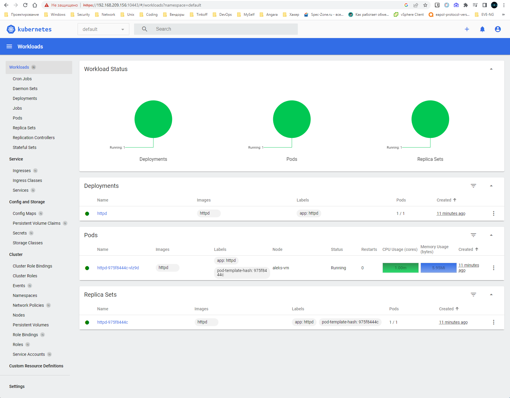

# Домашнее задание к занятию «Kubernetes. Причины появления. Команда kubectl»

### Цель задания

Для экспериментов и валидации ваших решений вам нужно подготовить тестовую среду для работы с Kubernetes. Оптимальное решение — развернуть на рабочей машине или на отдельной виртуальной машине MicroK8S.

------

### Чеклист готовности к домашнему заданию

1. Личный компьютер с ОС Linux или MacOS 

или

2. ВМ c ОС Linux в облаке либо ВМ на локальной машине для установки MicroK8S  

------

### Инструкция к заданию

1. Установка MicroK8S:
    - sudo apt update,
    - sudo apt install snapd,
    - sudo snap install microk8s --classic,
    - добавить локального пользователя в группу `sudo usermod -a -G microk8s $USER`,
    - изменить права на папку с конфигурацией `sudo chown -f -R $USER ~/.kube`.

2. Полезные команды:
    - проверить статус `microk8s status --wait-ready`;
    - подключиться к microK8s и получить информацию можно через команду `microk8s command`, например, `microk8s kubectl get nodes`;
    - включить addon можно через команду `microk8s enable`; 
    - список addon `microk8s status`;
    - вывод конфигурации `microk8s config`;
    - проброс порта для подключения локально `microk8s kubectl port-forward -n kube-system service/kubernetes-dashboard 10443:443`.

3. Настройка внешнего подключения:
    - отредактировать файл /var/snap/microk8s/current/certs/csr.conf.template
    ```shell
    # [ alt_names ]
    # Add
    # IP.4 = 123.45.67.89
    ```
    - обновить сертификаты `sudo microk8s refresh-certs --cert front-proxy-client.crt`.

4. Установка kubectl:
    - curl -LO https://storage.googleapis.com/kubernetes-release/release/`curl -s https://storage.googleapis.com/kubernetes-release/release/stable.txt`/bin/linux/amd64/kubectl;
    - chmod +x ./kubectl;
    - sudo mv ./kubectl /usr/local/bin/kubectl;
    - настройка автодополнения в текущую сессию `bash source <(kubectl completion bash)`;
    - добавление автодополнения в командную оболочку bash `echo "source <(kubectl completion bash)" >> ~/.bashrc`.

------

### Инструменты и дополнительные материалы, которые пригодятся для выполнения задания

1. [Инструкция](https://microk8s.io/docs/getting-started) по установке MicroK8S.
2. [Инструкция](https://kubernetes.io/ru/docs/reference/kubectl/cheatsheet/#bash) по установке автодополнения **kubectl**.
3. [Шпаргалка](https://kubernetes.io/ru/docs/reference/kubectl/cheatsheet/) по **kubectl**.

------

### Задание 1. Установка MicroK8S

1. Установить MicroK8S на локальную машину или на удалённую виртуальную машину.
```bash
alex@aleks-VM:~$ sudo apt update
...
alex@aleks-VM:~$ sudo apt install snapd
Чтение списков пакетов… Готово
Построение дерева зависимостей… Готово
Чтение информации о состоянии… Готово         
Уже установлен пакет snapd самой новой версии (2.59.1+23.04ubuntu1).
snapd помечен как установленный вручную.
Обновлено 0 пакетов, установлено 0 новых пакетов, для удаления отмечено 0 пакетов, и 21 пакетов не обновлено.
alex@aleks-VM:~$ sudo snapd install microk8s --classic
sudo: snapd: команда не найдена
alex@aleks-VM:~$ sudo snap install microk8s --classic
microk8s (1.26/stable) v1.26.4 от Canonical✓ установлен
alex@aleks-VM:~$ sudo usermod -a -G microk8s $USER
alex@aleks-VM:~$ sudo chown -f -R $USER ~/.kube
alex@aleks-VM:~$ microk8s status --wait-ready
Insufficient permissions to access MicroK8s.
You can either try again with sudo or add the user alex to the 'microk8s' group:

    sudo usermod -a -G microk8s alex
    sudo chown -R alex ~/.kube

After this, reload the user groups either via a reboot or by running 'newgrp microk8s'.
alex@aleks-VM:~$ newgrp microk8s
alex@aleks-VM:~$ microk8s status --wait-ready
microk8s is running
high-availability: no
  datastore master nodes: 127.0.0.1:19001
  datastore standby nodes: none
addons:
  enabled:
    ha-cluster           # (core) Configure high availability on the current node
    helm                 # (core) Helm - the package manager for Kubernetes
    helm3                # (core) Helm 3 - the package manager for Kubernetes
  disabled:
    cert-manager         # (core) Cloud native certificate management
    community            # (core) The community addons repository
    dashboard            # (core) The Kubernetes dashboard
    dns                  # (core) CoreDNS
    gpu                  # (core) Automatic enablement of Nvidia CUDA
    host-access          # (core) Allow Pods connecting to Host services smoothly
    hostpath-storage     # (core) Storage class; allocates storage from host directory
    ingress              # (core) Ingress controller for external access
    kube-ovn             # (core) An advanced network fabric for Kubernetes
    mayastor             # (core) OpenEBS MayaStor
    metallb              # (core) Loadbalancer for your Kubernetes cluster
    metrics-server       # (core) K8s Metrics Server for API access to service metrics
    minio                # (core) MinIO object storage
    observability        # (core) A lightweight observability stack for logs, traces and metrics
    prometheus           # (core) Prometheus operator for monitoring and logging
    rbac                 # (core) Role-Based Access Control for authorisation
    registry             # (core) Private image registry exposed on localhost:32000
    storage              # (core) Alias to hostpath-storage add-on, deprecated
alex@aleks-VM:~$ microk8s kubectl get nodes
NAME       STATUS   ROLES    AGE   VERSION
aleks-vm   Ready    <none>   68s   v1.26.4
```
------


2. Установить dashboard.

```bash
alex@aleks-VM:~$ microk8s status
microk8s is running
high-availability: no
  datastore master nodes: 127.0.0.1:19001
  datastore standby nodes: none
addons:
  enabled:
    ha-cluster           # (core) Configure high availability on the current node
    helm                 # (core) Helm - the package manager for Kubernetes
    helm3                # (core) Helm 3 - the package manager for Kubernetes
  disabled:
    cert-manager         # (core) Cloud native certificate management
    community            # (core) The community addons repository
    dashboard            # (core) The Kubernetes dashboard
    dns                  # (core) CoreDNS
    gpu                  # (core) Automatic enablement of Nvidia CUDA
    host-access          # (core) Allow Pods connecting to Host services smoothly
    hostpath-storage     # (core) Storage class; allocates storage from host directory
    ingress              # (core) Ingress controller for external access
    kube-ovn             # (core) An advanced network fabric for Kubernetes
    mayastor             # (core) OpenEBS MayaStor
    metallb              # (core) Loadbalancer for your Kubernetes cluster
    metrics-server       # (core) K8s Metrics Server for API access to service metrics
    minio                # (core) MinIO object storage
    observability        # (core) A lightweight observability stack for logs, traces and metrics
    prometheus           # (core) Prometheus operator for monitoring and logging
    rbac                 # (core) Role-Based Access Control for authorisation
    registry             # (core) Private image registry exposed on localhost:32000
    storage              # (core) Alias to hostpath-storage add-on, deprecated
alex@aleks-VM:~$ microk8s enable dashboard
Infer repository core for addon dashboard
Enabling Kubernetes Dashboard
Infer repository core for addon metrics-server
Enabling Metrics-Server
serviceaccount/metrics-server created
clusterrole.rbac.authorization.k8s.io/system:aggregated-metrics-reader created
clusterrole.rbac.authorization.k8s.io/system:metrics-server created
rolebinding.rbac.authorization.k8s.io/metrics-server-auth-reader created
clusterrolebinding.rbac.authorization.k8s.io/metrics-server:system:auth-delegator created
clusterrolebinding.rbac.authorization.k8s.io/system:metrics-server created
service/metrics-server created
deployment.apps/metrics-server created
apiservice.apiregistration.k8s.io/v1beta1.metrics.k8s.io created
clusterrolebinding.rbac.authorization.k8s.io/microk8s-admin created
Metrics-Server is enabled
Applying manifest
serviceaccount/kubernetes-dashboard created
service/kubernetes-dashboard created
secret/kubernetes-dashboard-certs created
secret/kubernetes-dashboard-csrf created
secret/kubernetes-dashboard-key-holder created
configmap/kubernetes-dashboard-settings created
role.rbac.authorization.k8s.io/kubernetes-dashboard created
clusterrole.rbac.authorization.k8s.io/kubernetes-dashboard created
rolebinding.rbac.authorization.k8s.io/kubernetes-dashboard created
clusterrolebinding.rbac.authorization.k8s.io/kubernetes-dashboard created
deployment.apps/kubernetes-dashboard created
service/dashboard-metrics-scraper created
deployment.apps/dashboard-metrics-scraper created
secret/microk8s-dashboard-token created

If RBAC is not enabled access the dashboard using the token retrieved with:

microk8s kubectl describe secret -n kube-system microk8s-dashboard-token

Use this token in the https login UI of the kubernetes-dashboard service.

In an RBAC enabled setup (microk8s enable RBAC) you need to create a user with restricted
permissions as shown in:
https://github.com/kubernetes/dashboard/blob/master/docs/user/access-control/creating-sample-user.md

alex@aleks-VM:~$
```

3. Сгенерировать сертификат для подключения к внешнему ip-адресу.

```bash
alex@aleks-VM:~$ vim.tiny /var/snap/microk8s/current/certs/csr.conf.template
alex@aleks-VM:~$ sudo microk8s refresh-certs --cert ca.crt
Taking a backup of the current certificates under /var/snap/microk8s/5219/certs-backup/
Creating new certificates
Cant load /root/.rnd into RNG
139909136655808:error:2406F079:random number generator:RAND_load_file:Cannot open file:../crypto/rand/randfile.c:88:Filename=/root/.rnd
Signature ok
subject=C = RU, ST = Moscow, L = Moscow, O = InfoSec, OU = Security, CN = 127.0.0.1
Getting CA Private Key
Signature ok
subject=CN = front-proxy-client
Getting CA Private Key
1
Creating new kubeconfig file
ошибка: snap "microk8s" has "service-control" change in progress

The CA certificates have been replaced. Kubernetes will restart the pods of your workloads.
Any worker nodes you may have in your cluster need to be removed and re-joined to become aware of the new CA.

alex@aleks-VM:~$ sudo microk8s refresh-certs --cert server.crt
Taking a backup of the current certificates under /var/snap/microk8s/5219/certs-backup/
Creating new certificates
Signature ok
subject=C = RU, ST = Moscow, L = Moscow, O = InfoSec, OU = Security, CN = 127.0.0.1
Getting CA Private Key
Restarting service kubelite.
Restarting service cluster-agent.
alex@aleks-VM:~$ sudo microk8s refresh-certs --cert front-proxy-client.crt
Taking a backup of the current certificates under /var/snap/microk8s/5219/certs-backup/
Creating new certificates
Signature ok
subject=CN = front-proxy-client
Getting CA Private Key
Restarting service kubelite.

```


------

### Задание 2. Установка и настройка локального kubectl
1. Установить на локальную машину kubectl.

```bash
alex@aleks-VM:~$ curl -LO https://storage.googleapis.com/kubernetes-release/release/`curl -s https://storage.googleapis.com/kubernetes-release/release/stable.txt`/bin/linux/amd64/kubectl
  % Total    % Received % Xferd  Average Speed   Time    Time     Time  Current
                                 Dload  Upload   Total   Spent    Left  Speed
100 46.9M  100 46.9M    0     0  34.7M      0  0:00:01  0:00:01 --:--:-- 34.7M
alex@aleks-VM:~$ chmod +x ./kubectl
alex@aleks-VM:~$ sudo mv ./kubectl /usr/local/bin/kubectl
alex@aleks-VM:~$ 
```

2. Настроить локально подключение к кластеру.

```bash
alex@aleks-VM:~$ microk8s kubectl port-forward -n kube-system service/kubernetes-dashboard 10443:443 --address 0.0.0.0
Forwarding from 0.0.0.0:10443 -> 8443

```

3. Подключиться к дашборду с помощью port-forward.

<p align="center">
  
</p>